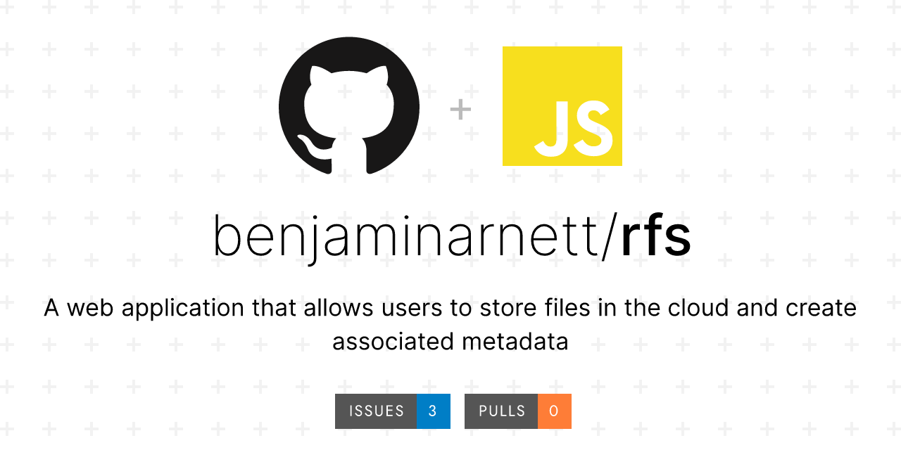
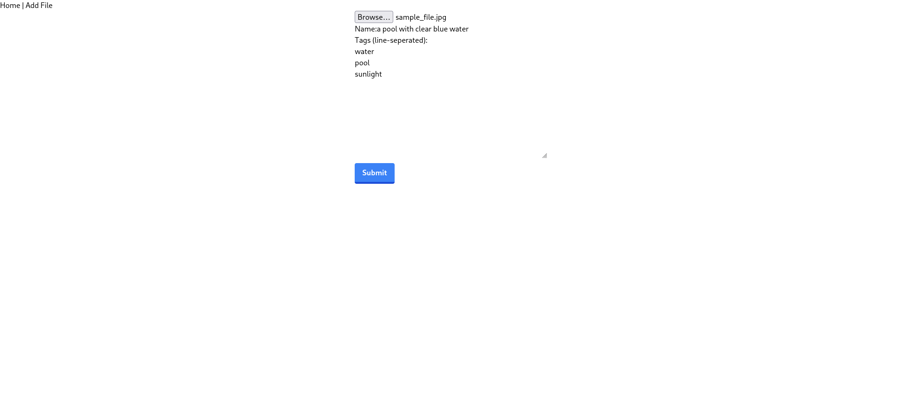
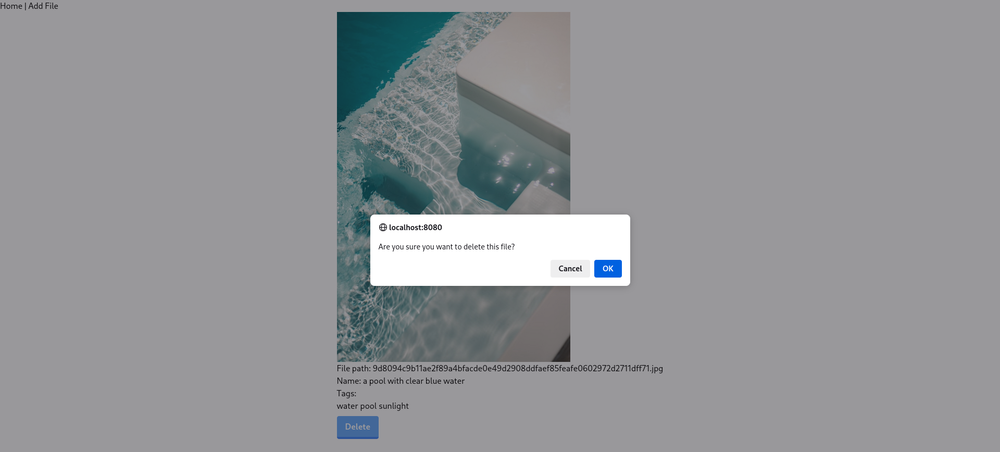
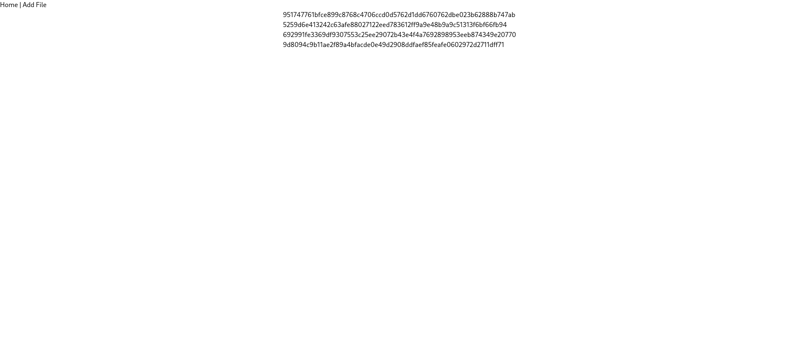

# rfs (Remote File System)

Rfs is a web application that allows users to store files in the cloud and create associated metadata (such as tags). The application uses modern frontend and backed development tools.

The combination of remote access and metadata creation via a web interface enables users to more easily collaborate in carrying out a variety of tasks such as file archival, data set creation, file management, etc.

## Table of Contents

- [Features](#features)
- [Screenshots](#screenshots)
- [Built With](#built-with)
- [Prerequisites](#prerequisites)
- [Getting Started](#getting-started)
- [Contribution Guidelines](#contribution-guidelines)
- [To-Do](#to-do)
- [Acknowledgments](#acknowledgments)

## Features

- Remote file storage
- File system navigation (with thumbnails for image files)
- Tagged metadata

## Screenshots

<table>
 <tr>
    <td style="border:none"></td>    
    <td style="border:none"></td>    
 </tr>
 <tr>
    <td style="border:none"></td>    
    <td style="border:none"></td>    
 </tr>
</table>


## Built With

- [NodeJS](https://nodejs.org/en/) - Node.js is an open-source, cross-platform JavaScript runtime environment.
  - [Express.js](https://expressjs.com) - Express.js is a minimal and flexible Node.js web application framework.
- [React](https://react.dev/) - React is an open-source front-end JavaScript library for building user interfaces.
  - [React Router](https://reactrouter.com/en/main) - React Router is a lightweight routing library for the React.
  - [Tanstack Query](https://tanstack.com/query/latest) - Tanstack Query is a powerful asynchronous state management for React.
  - [Tailwind CSS](https://tailwindcss.com/) - Tailwind CSS is a utility-first CSS framework.
- [esbuild](https://esbuild.github.io/) - Esbuild is an open-source module bundler and minifier for JavaScript.

## Prerequisites

- [NodeJS](https://nodejs.org/en/) version 21+

## Getting Started

Install and run the backend

```bash
cd backend
npm install
npm run dev
```

Open a seperate CLI, and install and run the frontend

```bash
cd frontend
npm install
npm run dev
```

## Contribution Guidelines

Contributors may contribute by submitting pull requests. Code quality, scope, contribution size, and a number of other such factors will be considered the review process to determine whether proposed changes are merged.  

## To-Do

- Custom metadata attributes
- Metadata querying
- Rendering
  - PDF rendering
  - Text file rendering
  - Toggle audio-only for video
- Editing
  - Metadata editing
    - UI elements
    - JSON
  - Text file editing

<!--
- Download button
- File too large (e.g. iso) - Uncaught (in promise) TypeError: SubtleCrypto.digest: ArrayBuffer branch of (ArrayBufferView or ArrayBuffer) can't be an ArrayBuffer or an ArrayBufferView larger than 2 GB
- Proxy - sole CORS error
- solve error - entering url yeilds 404 (only served via client, react-router)
- render html (w/ javascript) as webpage
-->

## Acknowledgments

- [Express.js documentation](https://expressjs.com/en/api.html)
- [React documentation](https://react.dev/reference/react)
- [React Router documentation](https://reactrouter.com/en/main)
- [Tanstack Query documentation](https://tanstack.com/query/latest/docs/framework/react/overview)
- [Tailwind CSS documentation](https://tailwindcss.com/docs/installation)
- [esbuild docmentation](https://esbuild.github.io/api/)
- [MDN Web Docs](https://developer.mozilla.org/en-US/)
- [Socialify](https://socialify.git.ci/) - project image
- [Unsplash](https://unsplash.com/photos/a-pool-with-clear-blue-water-and-a-white-bench-xwSr2LMxFL4) - screenshots sample image